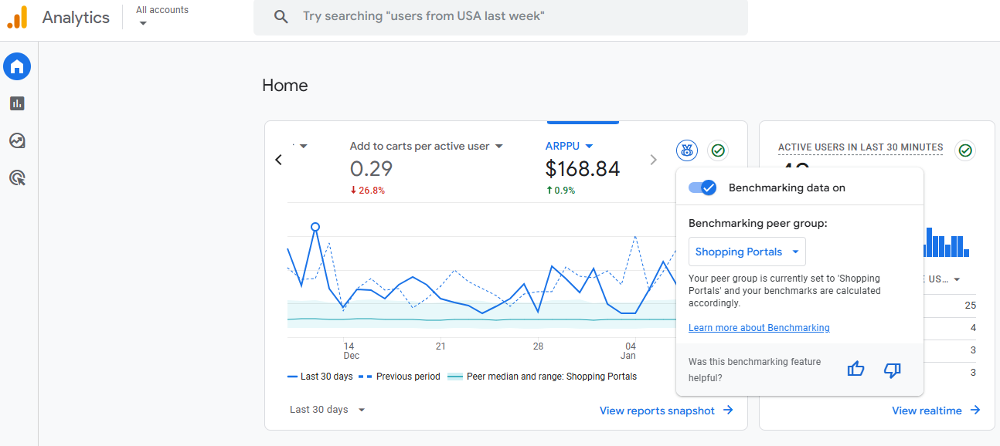
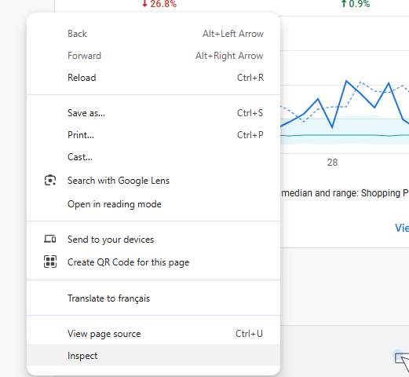
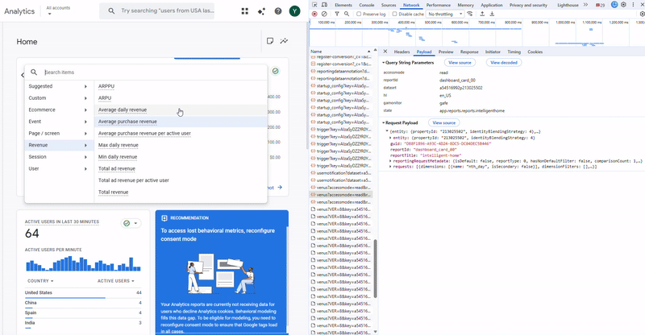
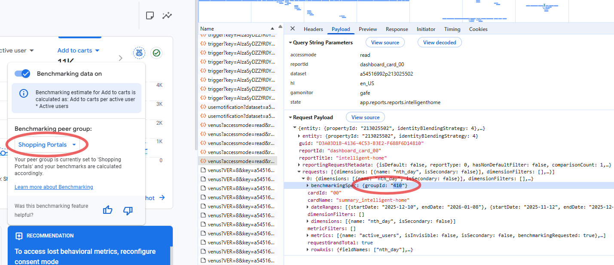
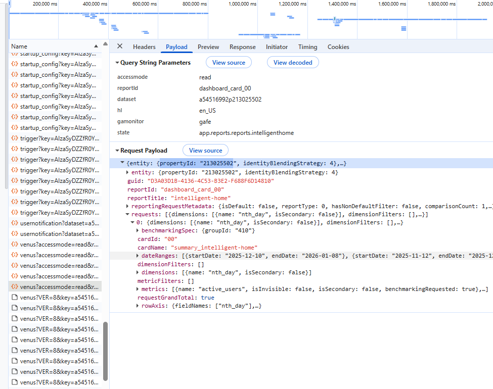
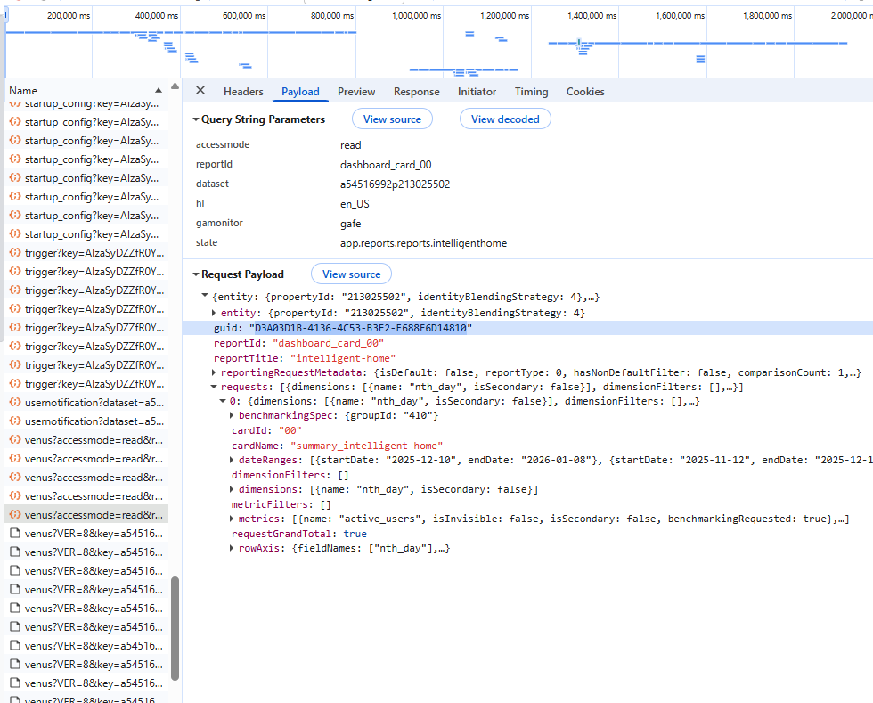
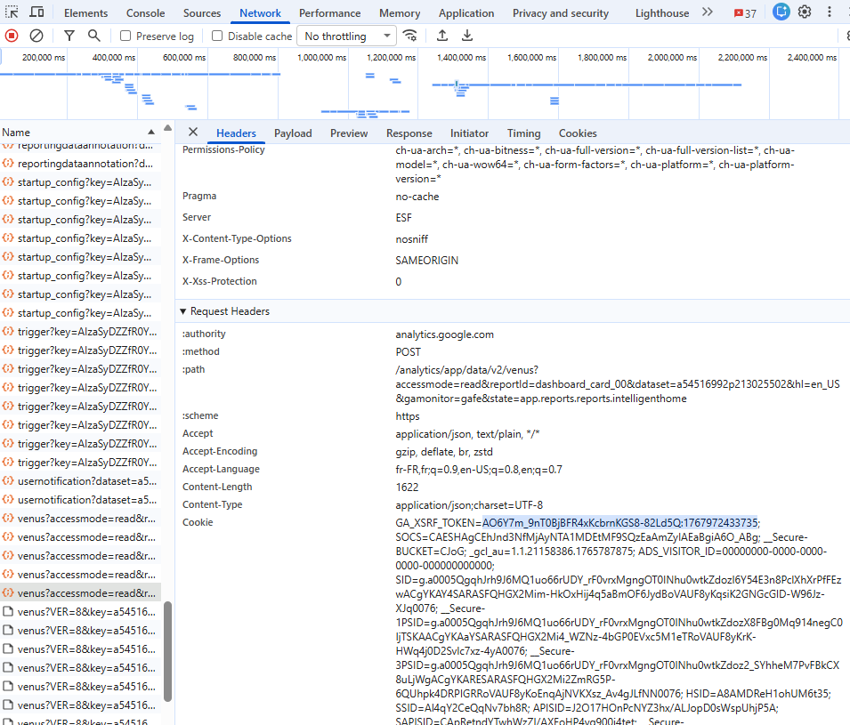
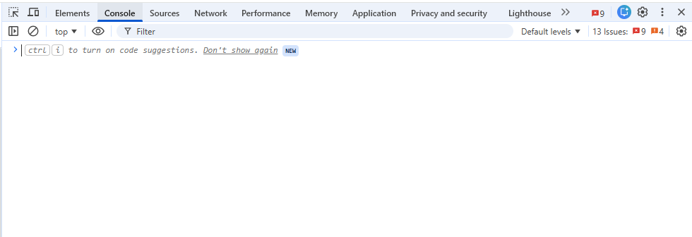

# GA4 Benchmarking Extractor (Percentiles + Performance) — JavaScript

This repository contains a JavaScript script that extracts **benchmarking data** from the Google Analytics 4 (GA4) interface, including **P25 / P50 / P75 percentiles** as well as **your own performance** for a list of metrics, over a defined **date range** and for a specific **Benchmark Industry / Group** (e.g. *“Alternative & Natural Medicine”*).

The script sends `POST` requests to an internal GA4 endpoint (`/data/v2/venus`) and then:
- aggregates results by **date** and **metric**
- displays the output using `console.table`
- generates and automatically downloads a **CSV file**

---

## ✅ What the script outputs

For each day and each metric:
- `percentile25`, `percentile50`, `percentile75`
- `metricValue` (your own performance)
- `groupName` (benchmark industry / group)
- metric categorization (E-commerce, Revenue, Session, User, …)

The generated CSV file contains the following columns:

- Date  
- Benchmark Industry  
- Metric Category  
- Metric Name  
- Percentile25  
- Percentile50  
- Percentile75  
- Your Own Performance  

---

## ⚠️ Prerequisites

- Access to **Google Analytics 4**
- Being **logged into GA4** in Chrome (or a compatible browser)
- Open GA4 (the first chart on the home page must be visible)



- Right-click anywhere on the page and select **Inspect**



- Select a KPI on the left side of the chart so it appears on the graph, then open the **Network** tab and look for the request named **`venus`** with **Request Method = POST**



- Retrieve information from **your own GA4 property** to replace the demo values:

### Required updates

- **Update the date range** you want to extract data for:
"const allDates = generateDateRangeISO("2025-05-01", "2025-11-11"); // ✏️ update"

- **Update the benchmarking industry (group ID)** for:
"const groupData = [{ id: 1083, label: "Alternative & Natural Medicine" }];
// ✏️ find it in: payload > Request > 0 > groupId"



- **Replace the demo GA4 property ID** for:
"entity: { propertyId: "213025502", identityBlendingStrategy: 4 }, // ✏️ update"
and in the URL
"const url = `${baseURL}?accessmode=read&reportId=dashboard_card_00&dataset=a47514551p213025502&hl=en_GB&gamonitor=gafe&state=app.reports.reports.intelligenthome`;"



- **Update the guid** for:
"guid: "D3A03D1B-4136-4C53-B3E2-F688F6D14810", // ✏️ update"



- **Update the XSRF token** for:
'X-GAFE4-XSRF-TOKEN': 'AO6Y7m_PWYqxvo-kJJXGEOUdtw2lglQP3Q:1762960582835', // ✏️ update



- Run the script in the browser console (DevTools context)



The CSV file will be downloaded automatically once the script finishes executing

⚠️ This script is not designed to be executed via Node.js.
It relies on browser APIs such as fetch, Blob, and the DOM (document.createElement).


---------------------------------French version below------------------------------


Ce repository contient un script JavaScript permettant d’extraire, depuis l’interface Google Analytics 4 (GA4), les **données de benchmarking** (percentiles **P25 / P50 / P75**) ainsi que **votre valeur** (“Your Own Performance”) pour une liste de métriques, sur une **plage de dates** donnée, et pour un **Benchmark Industry / Group** (ex : “Alternative & Natural Medicine”).

Le script exécute des requêtes `POST` vers l’endpoint interne GA4 (`/data/v2/venus`), puis :
- consolide les résultats par **date** et par **métrique**
- affiche un tableau `console.table`
- génère et télécharge un **CSV**.

---

## ✅ Ce que le script produit

Pour chaque jour et chaque métrique :
- `percentile25`, `percentile50`, `percentile75`
- `metricValue` (votre performance)
- `groupName` (industrie / groupe de benchmark)
- catégorisation de la métrique (E-commerce, Revenue, Session, User, …)

Le fichier CSV téléchargé contient les colonnes :

- Date  
- Benchmark Industry  
- Metric Category  
- Metric Name  
- Percentile25  
- Percentile50  
- Percentile75  
- Your Own Performance  

---

## ⚠️ Prérequis

- Un accès à **Google Analytics 4**
- Être **connecté** à GA4 dans Chrome (ou navigateur compatible)
- Ouvrir GA4 (le premier graphe de la page d'acueil benchmarking apparaît)


- Cliquer droite et puis cliquer sur **Inspecter**


- Choisir un KPI à gauche sur le graphe pour le faire apparraître et trouver dans le ruban "Network" à droite'venus' dont le "request Method" est "Post".


- Trouver des informations de votre propre compte GA4 pour remplacer des info démo.

* à changer la plage de date que vous voulez extraire des données pour la ligne 
'const allDates = generateDateRangeISO("2025-05-01", "2025-11-11"); // ✏️ à mettre à jour'

* à changer ID de sector que vous voulez extraire des données benchmarking à la linge:
'  const groupData = [{ id: 1083, label: "Alternative & Natural Medicine" }]; // ✏️ à mettre à jour en cherchant dans la payload > Request > 0 > Groupid'


* à remplacer l'ID de propriété GA4 démo (213025502) par la votre à ligne :
'entity: { propertyId: "213025502", identityBlendingStrategy: 4 }, // ✏️ à mettre à jour en allant chercher dans la payload'
et 
'const url = `${baseURL}?accessmode=read&reportId=dashboard_card_00&dataset=a47514551p213025502&hl=en_GB&gamonitor=gafe&state=app.reports.reports.intelligenthome`; // ✏️ mettre l'ID de propriété dataset dans l'url'


* à changer guid par la votre à ligne :
'guid: "D3A03D1B-4136-4C53-B3E2-F688F6D14810", // ✏️ à mettre à jour en allant chercher dans la payload'


* à changer token par la votre à ligne :
''X-GAFE4-XSRF-TOKEN': 'AO6Y7m_PWYqxvo-kJJXGEOUdtw2lglQP3Q:1762960582835', // ✏️ mettre à jour avec le token du header'


- Exécuter le script dans la **console** (contexte navigateur)


- Le téléchargement de fichiers sera automatique après la fin d'exécution de script (pour le CSV)

> Ce script n’est **pas** conçu pour être exécuté via Node.js : il utilise `fetch`, `Blob` et le DOM (`document.createElement`).

---

## 🚀 Installation

1. Cloner le repo :
```bash
git clone <https://github.com/DataMa-Solutions/GA4-Benchmarking-Data>
cd <GA4-Benchmarking-Data>
