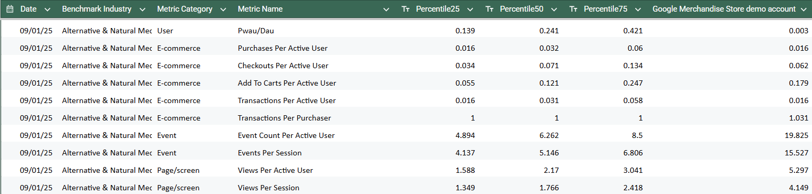

# GA4 Benchmarking Extractor (Percentiles + Performance) — JavaScript

## 👀 Overview

This repository contains a [JavaScript](https://github.com/DataMa-Solutions/GA4-Benchmarking-Data/blob/main/Javascript%20-GA4%20scraping%20.js) script that extracts **benchmarking data** from the Google Analytics 4 (GA4) interface, including **P25 / P50 / P75 percentiles** as well as **your own performance** for a list of metrics, over a defined **date range** and for a specific **Benchmark Industry / Group** (e.g. *“Alternative & Natural Medicine”*).

The script sends `POST` requests to an internal GA4 endpoint (`/data/v2/venus`) and then:
- aggregates results by **date** and **metric**
- displays the output using `console.table`
- generates and automatically downloads a **CSV file**

---

## ✅ What the script outputs

For each day and each metric:
- `percentile25`, `percentile50`, `percentile75`
- `metricValue` (your own performance)
- `groupName` (benchmark industry / group)
- metric categorization (E-commerce, Revenue, Session, User, …)

The generated CSV file contains the following columns:

- Date  
- Benchmark Industry  
- Metric Category  
- Metric Name  
- Percentile25  
- Percentile50  
- Percentile75  
- Your Own Performance  

---

## ⚠️ Prerequisites

- Access to **Google Analytics 4**
- Being **logged into GA4** in Chrome (or a compatible browser)
- Open GA4 (the first chart on the home page must be visible)

- Right-click anywhere on the page and select **Inspect**

- Select a KPI on the left side of the chart so it appears on the graph, then open the **Network** tab and look for the request named **`venus`** with **Request Method = POST**

- Retrieve information from **your own GA4 property** to replace the demo values:

### Required updates

Once you get the script, you need to adapt it to your GA account. Some updates are needed:

- **Update the date range** you want to extract data from:

Modify **2025-05-01** and **2025-11-11** in the code line:

`const allDates = generateDateRangeISO("2025-05-01", "2025-11-11"); // ✏️ update`

- **Update the benchmarking industry (group ID)**:

Modify **id: 1083** and **Alternative & Natural Medicine** in the code line:

`const groupData = [{ id: 1083, label: "Alternative & Natural Medicine" }]; // ✏️ find it in: payload > Request > 0 > groupId`

- **Replace the demo GA4 property ID** with your GA property ID:

Modify **213025502** in code line:

`entity: { propertyId: "213025502", identityBlendingStrategy: 4 }, // ✏️ update`

and **213025502** in the URL code line:

`${baseURL}?accessmode=read&reportId=dashboard_card_00&dataset=a47514551p213025502&hl=en_GB&gamonitor=gafe&state=app.reports.reports.intelligenthome`

- **Update the guid**:

Modify the guid in the code line:

`guid: "D3A03D1B-4136-4C53-B3E2-F688F6D14810", // ✏️ update`

- **Update the XSRF token**:

Modify the **AO6Y7m_PWYqxvo-kJJXGEOUdtw2lglQP3Q:1762960582835** in the code line:

`X-GAFE4-XSRF-TOKEN': 'AO6Y7m_PWYqxvo-kJJXGEOUdtw2lglQP3Q:1762960582835', // ✏️ update`

- Copy and paste the modified script in the browser console (DevTools context) and press Enter to run this script.

The CSV file will be downloaded automatically once the script finishes executing

⚠️ This script is not designed to be executed via Node.js.
It relies on browser APIs such as fetch, Blob, and the DOM (document.createElement).

